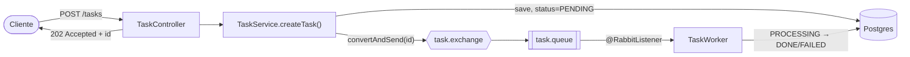

# Async Task Processor

Proyecto de aprendizaje: una API que recibe tareas pesadas, las encola y las procesa con workers en background, con reintentos, prioridades, tareas programadas y manejo de errores.

**Stack:** Spring Boot 3.5, Java 21, PostgreSQL, RabbitMQ, Docker Compose.

## Por qué

`POST /tasks` no debería hacer esperar al cliente mientras se procesa el trabajo pesado. La API valida, persiste la tarea con estado `PENDING` y responde `202 Accepted` con un id — el procesamiento real lo hace un worker asincrono que consume de una cola.

## Arquitectura actual



El mensaje de la cola lleva solo el `id` de la tarea, no el payload — el payload pesado vive en Postgres. Mensajes livianos y estado siempre consultable aunque el worker esté caído.

Reintentos con backoff exponencial vía TTL + Dead Letter Exchange: si el worker falla, el mensaje va a `task.retry` con un TTL creciente (`2^intentos * 10s`); al expirar, vuelve a `task.queue` para reintentarse. Agotados los reintentos, la tarea pasa a `FAILED` (con el error guardado) y el mensaje se publica en `task.dlq`. `GET /tasks/failed` lista las tareas en ese estado.

## Cómo levantarlo

```bash
docker compose up -d       # Postgres + RabbitMQ
./mvnw spring-boot:run      # API en http://localhost:8080
```

RabbitMQ management UI: http://localhost:15672 (`guest`/`guest`)

```bash
curl -X POST http://localhost:8080/tasks \
  -H "Content-Type: application/json" \
  -d '{"type": "demo", "payload": "hello"}'
```

## Estado

Proyecto en curso, construido objetivo por objetivo:

- [x] **Objetivo 1** — API que encola tareas
- [x] **Objetivo 2** — Worker que consume y procesa
- [x] **Objetivo 3** — Reintentos con backoff exponencial
- [x] **Objetivo 4** — Dead Letter Queue
- [ ] **Objetivo 5** — Colas de prioridad *(en curso)*
- [ ] **Objetivo 6** — Tareas programadas
- [ ] **Objetivo 7** — Endpoint de consulta de estado
- [ ] **Objetivo 8** — Dockerizar todo el sistema (API + worker + broker)
- [ ] **Objetivo 9** — Escalar workers + idempotencia
